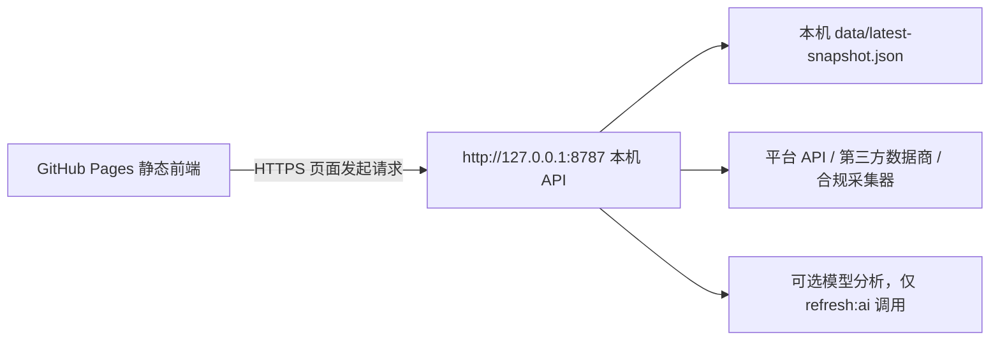

# 安全部署说明

## 架构



前端部署到 GitHub Pages，后端只在本机运行。这样平台密钥、OpenAI 密钥、账号密码和会话签名密钥都不会进入公开页面或 GitHub Pages。

## 本机后端

1. 复制环境变量：

```bash
cp .env.example .env
```

2. 修改 `.env`：

```bash
API_HOST=127.0.0.1
API_PORT=8787
DASHBOARD_USERNAME=你的登录账号
DASHBOARD_PASSWORD=换成强密码
SESSION_SECRET=换成另一段长随机字符串
CORS_ORIGINS=http://127.0.0.1:5173,http://localhost:5173,https://YOUR_GITHUB_USERNAME.github.io
```

3. 初始化数据并启动：

```bash
npm run refresh
npm run server
```

4. 每 12 小时更新：

```bash
npm run scheduler
```

也可以使用系统级定时任务：

```bash
0 */12 * * * cd /home/ec2-user/overseas-ecommerce-hot-products-monitor && /usr/bin/npm run refresh >> data/refresh.log 2>&1
```

## GitHub Pages 前端

1. 创建 GitHub 仓库并推送代码。
2. 在仓库 Settings -> Pages 中选择 GitHub Actions。
3. `.github/workflows/pages.yml` 会在 `main` 分支 push 后构建 `dist/` 并发布。
4. 打开 Pages URL，输入本机 API 地址、账号和密码登录。

## 安全要点

- 后端绑定 `127.0.0.1`，不监听 `0.0.0.0`。
- 前端只保存 API 地址到本机浏览器 `localStorage`，登录会话只保存在当前标签页的 `sessionStorage`。
- `CORS_ORIGINS` 只允许你的 GitHub Pages 域名和本地开发域名。
- 后端发送 `Access-Control-Allow-Private-Network: true`，用于 HTTPS 页面访问本机私有网络 API。
- `.env`、平台密钥、OpenAI 密钥、Token、账号密码和真实快照不提交到仓库。
- 如果需要远程访问后端，用 Tailscale、WireGuard 或 SSH tunnel，不要直接暴露端口。

## 模型调用策略

默认刷新命令不会调用模型：

```bash
npm run refresh
```

只有你需要重写选品 wiki 时才运行：

```bash
npm run refresh:ai
```

这会读取 `.env` 中的 `OPENAI_API_KEY` 和 `OPENAI_MODEL`。脚本会把看板快照压缩成结构化输入，要求模型只基于给定数据输出 wiki，避免在每次 12 小时刷新时产生不必要成本。
