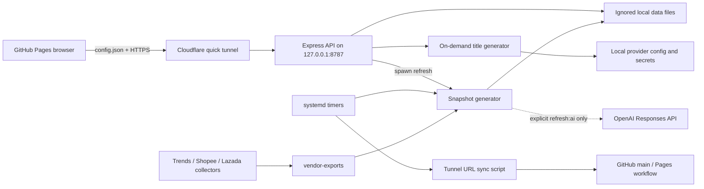

# Architecture

## Product and assumptions

This project is a login-protected cross-border ecommerce research dashboard. The browser is public static code; business data, credentials and connector configuration remain on the local host.

Load-bearing assumptions:

- GitHub Pages is untrusted/public and may contain only static assets plus a public backend URL.
- The local API is the sole data and authentication boundary.
- A source being configured does not mean it is integrated or producing evidence.
- Missing observations stay missing. Rule output and proxy metrics are not source facts.
- Cloudflare quick tunnel is temporary infrastructure, not a stable API contract.

## Components

| Layer | Technology | Main entry |
|---|---|---|
| Browser | React 19.2.7, Vite, Recharts, Phosphor Icons | `src/main.jsx` |
| API | Node.js, Express, Helmet, CORS | `server/index.js` |
| Data | JSON, CSV and Markdown files | `data/` |
| Pipeline | Node scripts and optional collectors | `scripts/update-data.js`, `scripts/collectors/` |
| Scheduling | systemd timers; optional process scheduler | host units, `scripts/scheduler.js` |
| Publishing | GitHub Actions Pages + Cloudflare tunnel | `.github/workflows/pages.yml`, sync script |

There is no database, queue, row-level security, webhook handler or email subsystem.

## Authentication and session flow

1. Browser reads a public API base from build config or `public/config.json`.
2. Browser sends username/password to `POST /api/login` over HTTPS.
3. Server compares both values with timing-safe equality, applies an in-memory per-client failure limit and signs `{sub, exp}` with HMAC-SHA256.
4. Browser stores only token and username in the current tab's `sessionStorage`.
5. Every protected request sends `Authorization: Bearer <token>`.
6. `requireSession` accepts either a valid signed session or the server-side `API_TOKEN`.

There is one application role. Sessions do not carry resource scopes, and connector/data access is all-or-nothing.

## Trust boundaries

| Crossing | Trust decision | Enforced by |
|---|---|---|
| Internet → GitHub Pages | All assets and `config.json` are public | Build/repository hygiene |
| Browser → API | Origin allowlist + valid login/session | CORS, `requireSession` |
| Tunnel → localhost | API remains bound to loopback | `API_HOST`, cloudflared unit |
| API → local files | Authenticated caller may read snapshot/wiki or write connectors | Route middleware and OS user |
| Generator → vendor files | Configured folder contents are treated as structured input | `loadVendorExports`; no sandbox |
| Generator → OpenAI | Only explicit AI command and both model variables enable call | CLI flag + env checks |
| Timer → Git/GitHub | Sync script may commit and push `public/config.json` | systemd unit + shell checks |

## Storage and data ownership

- Tracked public config: `data/platform-sources.json`, `data/connectors.example.json`, `public/config.json`.
- Ignored runtime data: connector values, vendor exports, snapshot, audit log and dynamic Wiki.
- API writes connector JSON directly; generator writes snapshot and Wiki directly, without temp-file atomic replacement.
- 标题生成器将生成记录、实验和缓存写到被忽略的 `data/title-generator/`，使用 0700/0600 与临时文件原子替换。模型仅在用户明确请求生成时从本机 ai-crypto 配置读取，定时快照不会调用它。
- Audit records include client IP, origin, user agent and some usernames; there is no rotation policy.

## Known risks and assumptions

- `scripts/update-data.js` uses seeded estimates for cost, margin, sentiment fallback and competition. These outputs are derived, not real observations.
- `scripts/collectors/google-trends.js` turns a relative index into a scaled proxy named `search90d`; it is not absolute search volume.
- `buildImportedTrend` fills missing days with numeric zero, so summaries can conflate missing with zero despite the lineage caveat.
- `buildSkuGroups` uses exact title/category/tier identity; cross-platform merge has no stable product identifier.
- Only `csv-folder` is consumed by the generator. Other connector cards are configuration placeholders.
- The risk route does not call patent, trademark, customs, cultural-policy or return-data providers.
- Authenticated users can set a local folder path; `loadVendorExports` does not confine it to an approved root. Treat dashboard credentials as local-operator level until this is fixed.
- Collector config logs the full proxy URL. A proxy URL containing credentials could leak into logs.
- Login limiting is in memory and resets on restart. There is no distributed or durable lockout.
- API errors return `error.message` to clients, which may expose internal details.
- Refresh can be triggered by both systemd and the API; the API lock does not coordinate with the systemd process.
- Current systemd refresh is 6-hourly while snapshot/server metadata says 12 hours and the standalone scheduler defaults to 24 hours.
- Pages CI builds and deploys but does not run the repository's behavior/security checks.
- `src/main.jsx` imports React directly, but `react` and `react-dom` are not direct `package.json` dependencies; the current 19.2.7 install is supplied by the transitive peer-dependency tree.

## Related documents

- [Project LLM operating contract](../AGENTS.md)
- [LLM Wiki index](../docs/wiki/index.md)
- [Current state](../docs/wiki/current-state.md)
- [Code index](../docs/wiki/code-index.md)
- [CodeGraph index](../docs/wiki/codegraph-index.md)
- [Data index](../docs/wiki/data-index.md)
- [Wiki maintenance log](../docs/wiki/log.md)
- [Flows](flows.md)
- [Permissions](permissions.md)
- [Variables](variables.md)
- [Tests](tests.md)
- [Scheduled work](cron.md)
- [Automation and model use](automation.md)
- [Public/SEO surface](seo.md)

No email is sent, so there is no `emails.md`.
